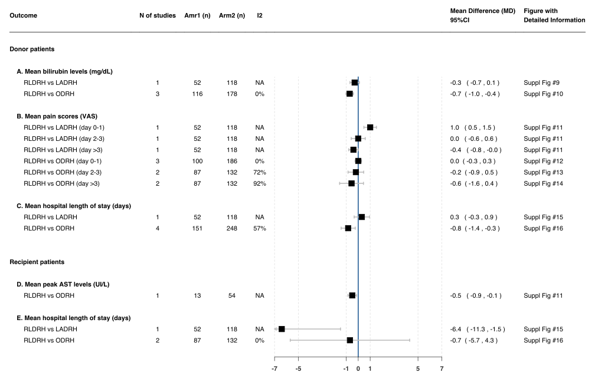
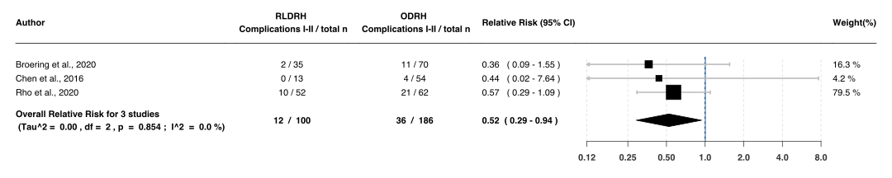
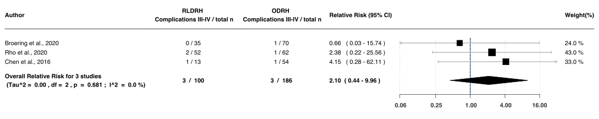

Hepatectomy
================
Oscar J. Ponce & Eddy Lincango
18/11/2020

## Summary of forest plots - *Donors Patients*

### Supplementary Figure 1

<b>Show figure</b> - Difference in mean total operative time
(min) after RLDRH versus LADRH

<!-- -->

### Supplementary Figure 2

<b>Show figure</b> - Difference in mean total operative time
(min) after RLDRH versus ODRH

<!-- -->

### Supplementary figure 3

 <b>Show figure</b> - Difference in mean blood loss (mL) after
RLDRH versus LADRH

<!-- -->

### Supplementary figure 4

<b>Show figure</b> - Difference in mean blood loss (mL) after
RLDRH versus ODRH 

### Supplementary figure 5

<b>Show figure</b> - Difference in mean peak ALT levels (IU/L)
after RLDRH versus LADRH

<!-- -->

### Supplementary figure 6

<b>Show figure</b> - Difference in mean peak ALT levels (IU/L)
after RLDRH versus ODRH

<!-- -->

### Supplementary figure 7

<b>Show figure</b> - Difference in mean peak AST levels (IU/L)
after RLDRH versus LADRH

<!-- -->

### Supplementary figure 8

<b>Show figure</b> - Difference in mean peak AST levels (IU/L)
after RLDRH versus ODRH

<!-- -->

## Summary of forest plots - *Recipient Patients*

### Supplementary figure 9

<b>Show figure</b> - Difference in mean blood loss (mL) after
RLDRH versus ODRH

<!-- -->

### Supplementary figure 10

<b>Show figure</b> - Difference in mean ALT peak levels (IU/L)
after RLDRH versus ODRH

<!-- -->

### Supplementary figure 11

<b>Show figure</b> - Difference in mean AST peak levels (U/L)
afterRLDRH versus ODRH

<!-- -->

# Overall1

<!-- -->

### Supplementary figure 9

<b>Show figure</b> - Difference in mean peak total bilirubin
levels (mg/dL) after RLDRH versus LADRH

<!-- -->

### Supplementary figure 10

<b>Show figure</b> - Difference in peak total bilirubin levels
(mg/dL) after RLDRH versus ODRH

<!-- -->

### Supplementary figure 11

<b>Show figure</b> - Difference in mean pain scores (VAS) after
RLDRH versus LADRH

<!-- -->

 Supp Fig 12: RLDRH versus ODRH - Difference in mean pain
scores (VAS) at day 0-1 

<!-- -->

<!-- -->

 Supp Fig 13: RLDRH versus ODRH - Difference in pain scores
(VAS) at day 2-3 

<!-- -->

 Supp Fig 14: RLDRH versus ODRH - Difference in pain scores
(VAS) at day greater than 3 

<!-- -->

 

### Supplementary figure 15

<b>Show figure</b> - Difference in mean length of hospital stay
(days) after RLDRH versus LADRH

<!-- -->

### Supplementary figure 16

<b>Show figure</b> - Difference in mean length of hospital stay
(days) after RLDRH versus ODRH

<!-- -->

# Overall2

<!-- -->

### Figure 16

<b>Show figure</b> - Risk of postoperative complications
Clevien-Dindo I-II at 30 days after RLDRH versus LADRH

<!-- -->

### Figure 17

<b>Show figure</b> - Risk of postoperative complications
Clevien-Dindo III-IV at 30 days after RLDRH versus LADRH

<!-- -->

### Figure 18

<b>Show figure</b> - Risk of postoperative Clevien-Dindo
complications I-II at 30 days after RLDRH versus ODRH

<!-- -->

### Figure 19

<b>Show figure</b> - Risk of postoperative complications
Clevien-Dindo III-IV at 30 days after RLDRH versus ODRH

<!-- -->

## Summary of forest plots - *Recipient Patients*

### Figure 20

<b>Show figure</b> - Difference in mean length of hospital stay
(days) after RLDRH versus LADRH

<!-- -->

### Figure 21

<b>Show figure</b> - Difference in mean length of hospital stay
(days) after RLDRH versus ODRH

<!-- -->

### Figure 25

<b>Show figure</b> - Difference in mean peak total bilirubin
levels after RLDRH versus ODRH

<!-- -->

### Figure 26

<b>Show figure</b> - Mortality risk at 30 days after RLDRH
versus LADRH

<!-- -->

### Figure 27

<b>Show figure</b> - Mortality risk at 30 days after RLDRH
versus ODRH

<!-- -->

### Figure 28

<b>Show figure</b> - Risk of postoperative complications
Clevien-Dindo I-II at 30 days after RLDRH versus LADRH

<!-- -->

### Figure 29

<b>Show figure</b> - Risk of postoperative complications
Clevien-Dindo I-II at 30 days after RLDRH versus ODRH

<!-- -->

### Figure 30

<b>Show figure</b> - Risk of postoperative complications
Clevien-Dindo III-IV at 30 days after RLDRH versus LADRH

<!-- -->

### Figure 31

<b>Show figure</b> - Risk of postoperative complications
Clevien-Dindo III-IV at 30 days after RLDRH versus ODRH

<!-- -->

