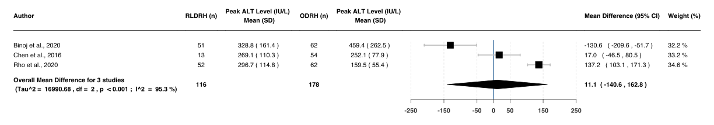

Hepatectomy
================
Oscar J. Ponce & Eddy Lincango
18/11/2020

## Summary of forest plots - *Donors Patients*

### Figure 2

 <b>Show figure</b> - Differences in blood loss (mL) after
RLDRH vs LADRH

<!-- -->

### Figure 3

<b>Show figure</b> - Differences in blood loss (mL) after RLDRH
vs ODRH 

### Figure 4

<b>Show figure</b> - Differences in length of hospital stay
(days) after RLDRH vs LADRH

<!-- -->

### Figure 5

<b>Show figure</b> - Differences in length of hospital stay
(days) after RLDRH vs ODRH

<!-- -->

### Figure 6

<b>Show figure</b> - Differences in pain (VAS) after RLDRH vs
LADRH

<!-- -->

### Figure 7

<b>Show figure</b> - Differences in pain (VAS) after RLDRH vs
ODRH

<!-- -->

> To generate this forest plot, we used information from Supplementary
> Figures 1 to 3.

 

> **Show supplementary figures used to generate Figure 7**

  - 
    
    

    
    
 Supp Fig 1: RLDRH vs ODRH - Pain (VAS) at day 0-1
    

    
    

    
    <!-- -->
    
    

    
    

  - 
    
    

    
    
 Supp Fig 2: RLDRH vs ODRH - Pain (VAS) at day 2-3
    

    
    

    
    <!-- -->
    
    

    
    

  - 
    
    

    
    
 Supp Fig 3: RLDRH vs ODRH - Pain (VAS) at day greater than
    3 

    
    

    
    <!-- -->
    
    

    
    

 

### Figure 8

<b>Show figure</b> - Differences in peak ALT level (IU/L) after
RLDRH vs LADRH

<!-- -->

### Figure 9

<b>Show figure</b> - Differences in peak ALT level (IU/L) after
RLDRH vs ODRH

<!-- -->

### Figure 10

<b>Show figure</b> - Differences in peak AST level (IU/L) after
RLDRH vs LADRH

<!-- -->

### Figure 11

<b>Show figure</b> - Differences in peak AST level (IU/L) after
RLDRH vs ODRH

<!-- -->

### Figure 12

<b>Show figure</b> - Differences in peak total Bilirubin
(mg/dL) after RLDRH vs LADRH

<!-- -->

### Figure 13

<b>Show figure</b> - Differences in peak total Bilirubin
(mg/dL) after RLDRH vs ODRH

<!-- -->

### Figure 14

<b>Show figure</b> - Differences in total operative time (min)
after RLDRH vs LADRH

<!-- -->

### Figure 15

<b>Show figure</b> - Differences in total operative time (min)
after RLDRH vs ODRH

<!-- -->

