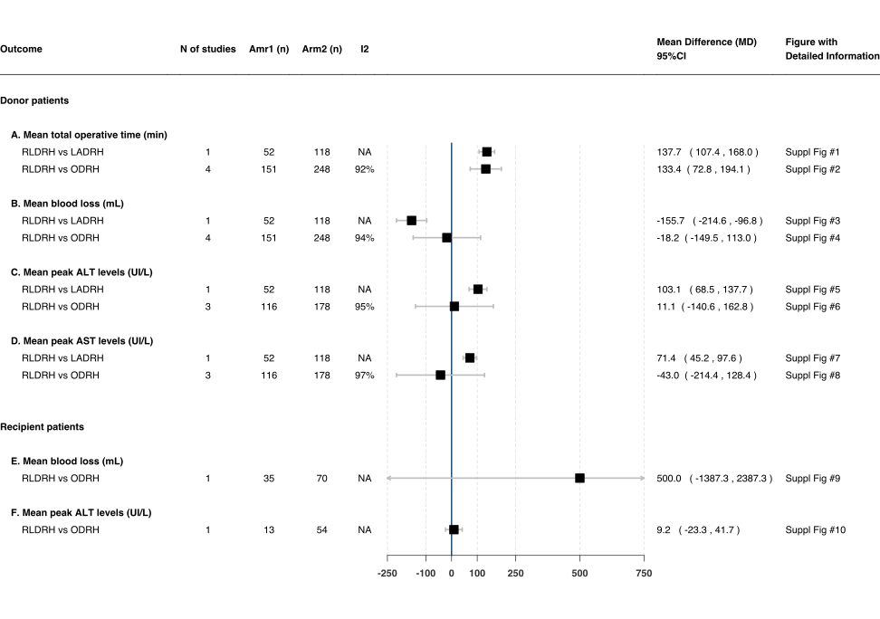
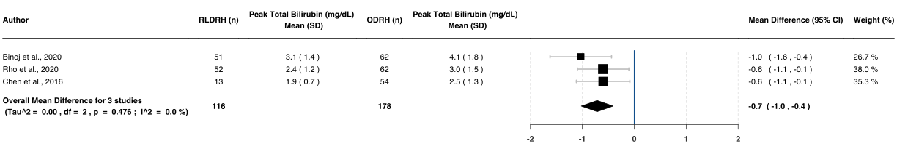
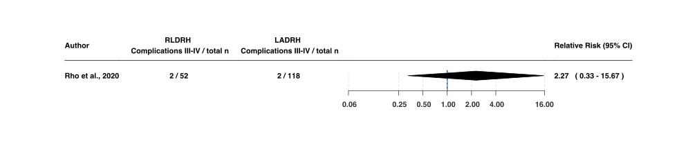

Hepatectomy
================
Oscar J. Ponce & Eddy Lincango
18/11/2020

## Figure 2: Continuous Outcomes Part 1

<!-- -->

**Supplementary information for figure 1**

Suppl. figure 1: Mean total operative time (min) after RLDRH vs
LADRH

<!-- -->

Suppl. figure 2: Mean total operative time (min) after RLDRH vs
ODRH

<!-- -->

Suppl. figure 3: Mean blood loss (mL) after RLDRH vs
LADRH

<!-- -->

Suppl. figure 4: Mean blood loss (mL) after RLDRH versus ODRH

Suppl. figure 5: Mean peak ALT levels (IU/L) after RLDRH versus
LADRH

<!-- -->

Suppl. figure 6: Mean peak ALT levels (IU/L) after RLDRH versus
ODRH

<!-- -->

Suppl. figure 7: Mean peak AST levels (IU/L) after RLDRH versus
LADRH

<!-- -->

Suppl. figure 8: Mean peak AST levels (IU/L) after RLDRH versus
ODRH

<!-- -->

Suppl. figure 9: Mean blood loss (mL) after RLDRH versus
ODRH

<!-- -->

Suppl. figure 10: Mean ALT peak levels (IU/L) after RLDRH
versus ODRH

<!-- -->

## Figure 3: Continuous Outcomes Part 2

<!-- -->

**Supplementary information for figure 3**

Suppl. figure 11: Mean peak total bilirubin levels (mg/dL)
after RLDRH vs LADRH

<!-- -->

Suppl. figure 12: Mean peak total bilirubin levels (mg/dL)
after RLDRH vs ODRH

<!-- -->

Suppl. figure 13: Mean pain scores (VAS) after RLDRH vs
LADRH

<!-- -->

Suppl. figure 14: Mean pain scores (VAS) at day 0-1 after RLDRH
vs ODRH

<!-- -->

Suppl. figure 15: Mean pain scores (VAS) at day 2-3 after RLDRH
vs ODRH

<!-- -->

Suppl. figure 16: Mean pain scores (VAS) at day \>3 after RLDRH
vs ODRH

<!-- -->

Suppl. figure 17: Mean length of hospital stay (days) after
RLDRH vs LADRH

<!-- -->

Suppl. figure 18: Mean length of hospital stay (days) after
RLDRH vs ODRH

<!-- -->

Suppl. figure 19: Mean AST peak levels (U/L) after RLDRH vs
ODRH

<!-- -->

Suppl. figure 20: Mean peak total bilirubin levels after RLDRH
vs ODRH

<!-- -->

Suppl. figure 21: Mean length of hospital stay (days) after
RLDRH vs LADRH

<!-- -->

Suppl. figure 22: Mean length of hospital stay (days) after
RLDRH vs ODRH

<!-- -->

# Figure 4: Dichotomous outcomes

<!-- -->

**Supplementary information for figure 4**

Suppl. figure 23: Mortality risk at 30 days after RLDRH vs
LADRH

<!-- -->

Suppl. figure 24: Mortality risk at 30 days after RLDRH vs
ODRH

<!-- -->

Suppl. figure 25: Clevien-Dindo I-II at 30 days after RLDRH vs
LADRH

<!-- -->

Suppl. figure 26: Clevien-Dindo complications I-II at 30 days
after RLDRH vs ODRH

<!-- -->

Suppl. figure 27: Clevien-Dindo III-IV at 30 days after RLDRH
vs LADRH

<!-- -->

Suppl. figure 28: Clevien-Dindo III-IV at 30 days after RLDRH
vs ODRH

<!-- -->

Suppl. figure 29: Clevien-Dindo I-II at 30 days after RLDRH vs
LADRH

<!-- -->

Suppl. figure 30: Clevien-Dindo I-II at 30 days after RLDRH vs
ODRH

<!-- -->

Suppl. figure 31: Clevien-Dindo III-IV at 30 days after RLDRH
VS LADRH

<!-- -->

Suppl. figure 32: Clevien-Dindo III-IV at 30 days after RLDRH
vs ODRH

<!-- -->

